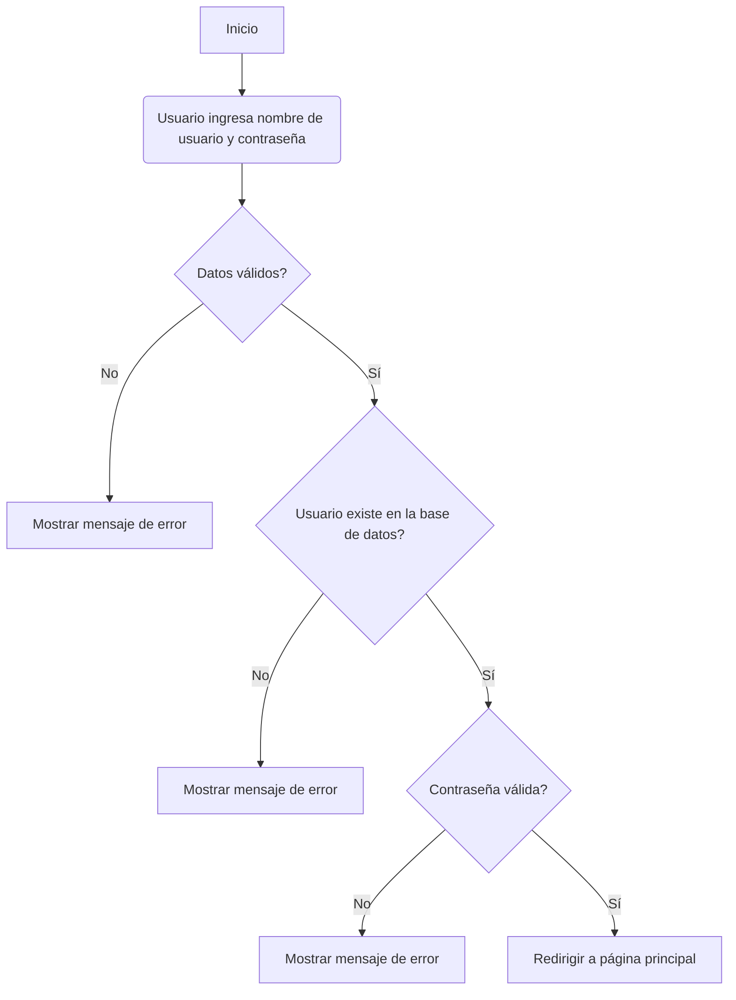

```mermaid
graph TD;
    A[Inicio] --> B(Usuario ingresa nombre de usuario y contraseña);
    B --> C{Datos válidos?};
    C -- No --> D[Mostrar mensaje de error];
    C -- Sí --> E{Usuario existe en la base de datos?};
    E -- No --> F[Mostrar mensaje de error];
    E -- Sí --> G{Contraseña válida?};
    G -- No --> H[Mostrar mensaje de error];
    G -- Sí --> I[Redirigir a página principal];
```